<div align="center">

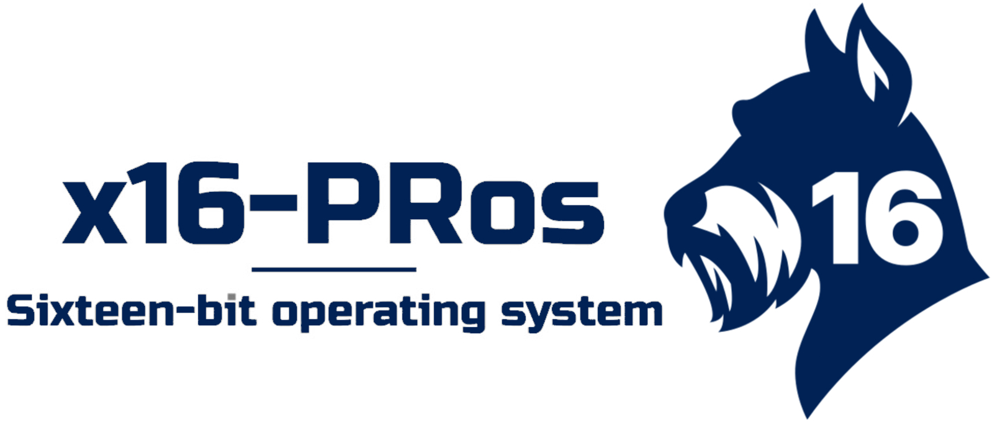

<h1>x16-PRos Operating System</h1>

[](LICENSE.TXT)
[](docs/changes/v1.0.txt)

[](https://github.com/PRoX2011/x16-PRos/stargazers)
[](https://github.com/PRoX2011/x16-PRos/commits)
[](CONTRIBUTING.md)


**A minimalistic 16-bit operating system written in NASM for x86 architecture**

[Website](https://x16-pros.prosdev.org/) • [API Documentation](docs/API.md) • [Configs Documentation](docs/CONFIGURATION.md)

<div style="display: flex; flex-direction: row; gap: 20px">
  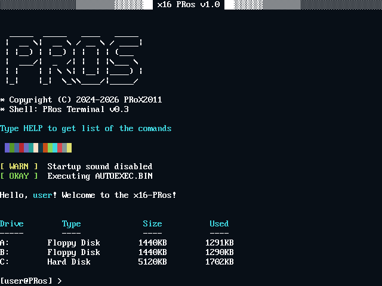
  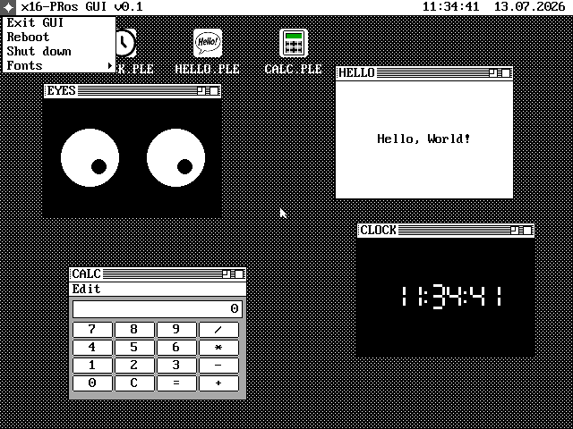
</div>

---

</div>


## Overview

**x16-PRos** is a lightweight real-mode multitasking operating system designed for the x86 architecture and written entirely in NASM. It features CLI, TUI and GUI interfaces, supports the FAT12 file system, and includes a large standard software suite.

Also it`s a platform for low-level programming enthusiasts to explore development for x86 operating systems.

> [!IMPORTANT]
> The project needs contributors. Now only I, PRoX2011, is working on the kernel, but I can’t do everything alone. I would like to ask you how to help the project.
> - Programs
> - Development of a compatibility layer with MS DOS
> - Improved documentation and instructions
>
> If you help - thank you so much

<div style="display: flex; flex-direction: row; gap: 20px">
  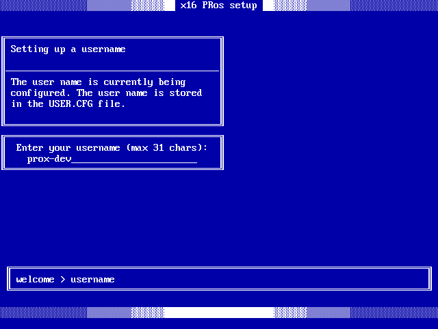
  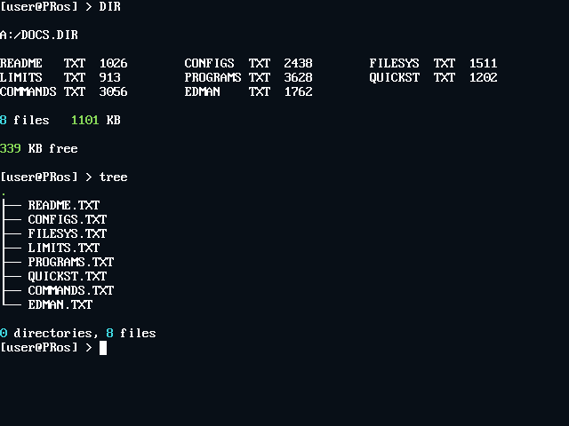
</div>
<br>
<div style="display: flex; flex-direction: row; gap: 20px">
  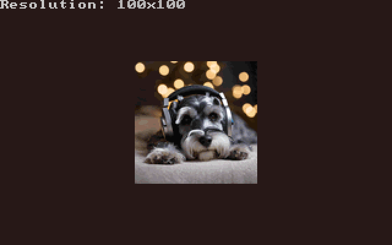
  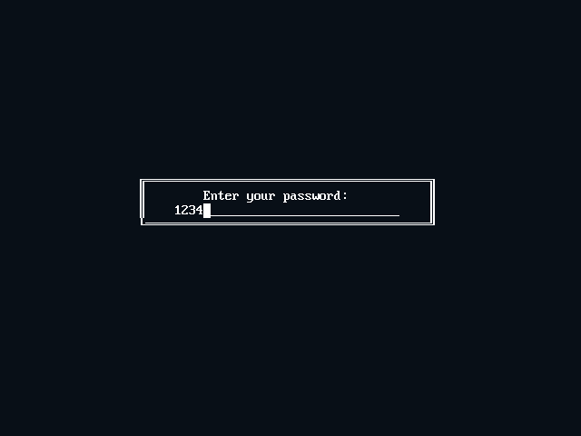
</div>

---

Developing this project requires a lot of time and effort. The project is completely open source. Everything is being done out of pure passion, so if you like it, I'd like to ask you to support me (PRoX2011) financially using this link: [support me](https://dalink.to/proxdev)

Thanks to everyone who supported me financially. All your nicknames will appear in the project's sponsors list.

---

## Key Features

- **MS-DOS Compatibility**: Native support for running standard MS-DOS `.COM` and `.EXE` executables - Windows 1.01, DOOM and Turbo C 2.0 runs on x16-PRos
- **Multitasking**: Cooperative multitasking support for `.PLE` programs
- **GUI**: Customizable graphical user interface for windowed `.PLE` programs
- **Native assembler**: Intel syntax assembler with which you can create programs directly in the operating system  
- **User Authentication**: Login system with configurable user account using XOR-encrypted password
- **Customization**: 10+ color themes and fully customizable THEME.CFG, command prompt, username, timezone, and font settings
- **Over 40 bundled programs**: Games, file utilities, players, BMP viewer with upscale, paint program, and more
- **First-Boot Setup**: A setup wizard that installs the OS on your PC and helps you to customize everything for yourself 
- **Auto-Execution**: AUTOEXEC.BIN support
- **Mouse Driver**: Mouse support for `.BIN` and `.PLE` programs and MS-DOS compatibility layer
- **Multiple disk support**: Detect/list available drives, switch drives, install x16-PRos on any of theese
- **cp866 support**: Russian-language text documents reading in cp866 encoding
- **Sound**: PC speaker, Sound Blaster WAV playback and AdLib/OPL2 IMF music
- **AND MUCH MORE**

---


## 🖥️ PRos Terminal

The system includes a powerful terminal - **PRos Terminal**. It not only allows you to launch programs but also offers a wide range of built-in commands and utilities.

> [!NOTE]
> To run a program, enter the name of the executable file (`.BIN`, `.PLE`, `.COM` or `.EXE`) with or without an extension. Programs will be launched from any directory if its `.BIN` file is placed in the `BIN/` (or for `.PLE` programs in `PLE/`) directory, and if the program file is not found there, the system will try to find the program in the current, working directory

<div style="display: flex; flex-direction: row; gap: 20px">
  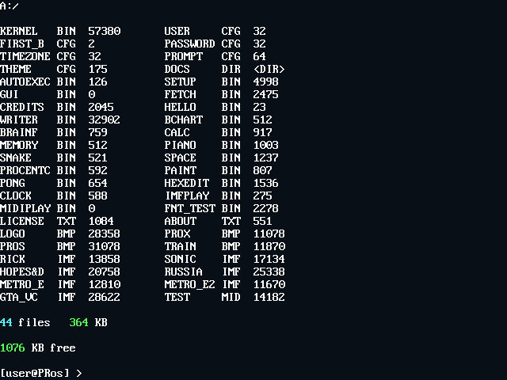
  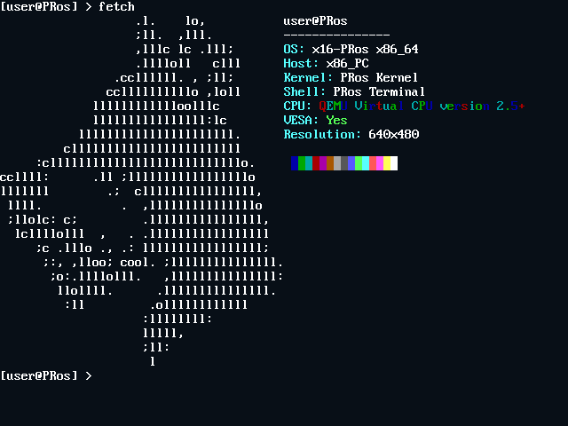
</div>
<br>
<div style="display: flex; flex-direction: row; gap: 20px">
  
  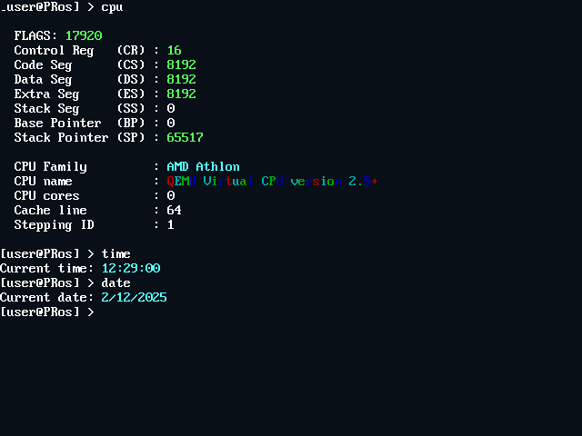
</div>

#### Basic Commands
| Command | Description |
|---------|-------------|
| `help` | Display categorized command reference with navigation |
| `info` | Show system information and OS details |
| `cls` | Clear terminal screen |
| `ver` | Display PRos terminal version |
| `exit` | Exit to bootloader |

#### System Information
| Command | Description |
|---------|-------------|
| `cpu` | Display detailed CPU information (family, model, cores, cache) |
| `date` | Show current date (DD/MM/YY format) |
| `time` | Show current time (HH:MM:SS format, UTC) |

#### File Operations
| Command | Syntax | Description |
|---------|--------|-------------|
| `dir` | `dir` | List files in current directory with size info |
| `cat` | `cat <filename>` | Display file contents |
| `size` | `size <filename>` | Show file size in bytes |
| `del` | `del <filename>` | Delete a file (kernel.bin protected) |
| `copy` | `copy <source> <dest>` | Copy file (root directory only) |
| `ren` | `ren <old> <new>` | Rename file (root directory only) |
| `touch` | `touch <filename>` | Create empty file |
| `write` | `write <file> <text>` | Write text to file |
| `bg` | `bg <file>` | Run `.PLE` program in the background |

#### Directory Operations
| Command | Syntax | Description |
|---------|--------|-------------|
| `cd` | `cd <dirname>` | Change directory (use `..` for parent, `/` for root) |
| `mkdir` | `mkdir <dirname>` | Create new directory |
| `deldir` | `deldir <dirname>` | Delete empty directory |

#### Media & Display
| Command | Syntax | Description |
|---------|--------|-------------|
| `view` | `view <file> [-upscale] [-stretch]` | Display BMP image with optional 2x scaling |

#### Power Management
| Command | Description |
|---------|-------------|
| `shut` | Shutdown system via APM |
| `reboot` | Restart system |


---

## 📦 Standard Software Package

x16-PRos includes a comprehensive collection of built-in applications:

<table>
<tr>
  <td width="33%" align="center">
    <br>
    <b>WRITER.BIN</b><br>
    Simple editor for text files
  </td>
  <td width="33%" align="center">
    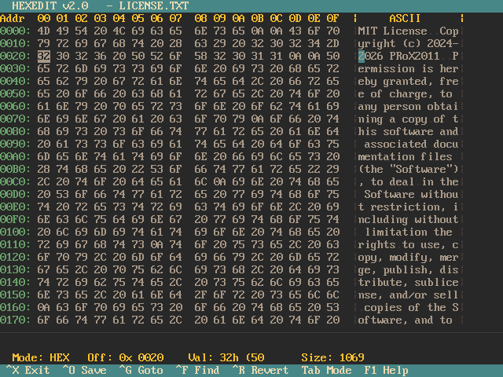<br>
    <b>HEXEDIT.BIN</b><br>
    Hex editor
  </td>
  <td width="33%" align="center">
    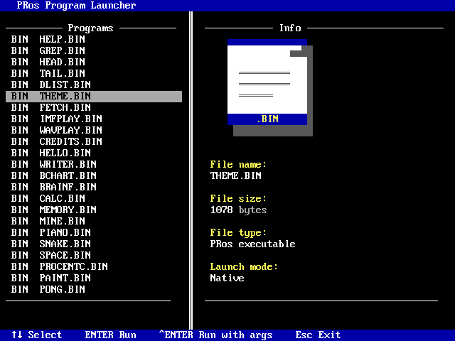<br>
    <b>LAUNCH.BIN</b><br>
    TUI program launcher
  </td>
</tr>
<tr>
  <td width="33%" align="center">
    <br>
    <b>MINE.BIN</b><br>
    Minesweeper game
  </td>
  <td width="33%" align="center">
    <br>
    <b>PIANO.BIN</b><br>
    Simple piano to play melodies using PC Speaker
  </td>
  <td width="33%" align="center">
    <br>
    <b>BCHART.BIN</b><br>
    Barchart software for creating simple diagrams
  </td>
</tr>
<tr>
  <td width="33%" align="center">
    <br>
    <b>SPACE.BIN</b><br>
    Space arcade game
  </td>
  <td width="33%" align="center">
    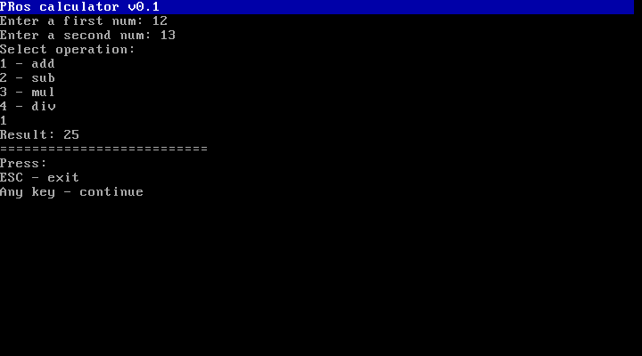<br>
    <b>CALC.BIN</b><br>
    Simple calculator
  </td>
  <td width="33%" align="center">
    <br>
    <b>MEMORY.BIN</b><br>
    Memory viewer
  </td>
</tr>
<tr>
  <td width="33%" align="center">
    <br>
    <b>PAINT.BIN</b><br>
    Paint program
  </td>
  <td width="33%" align="center">
    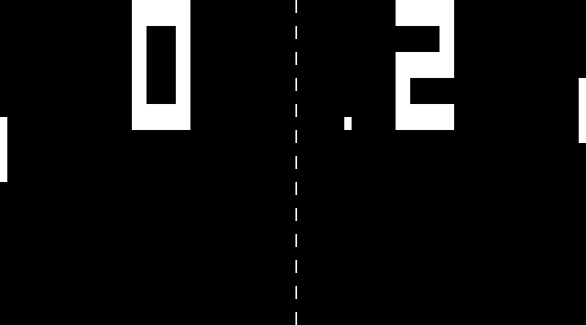<br>
    <b>PONG.BIN</b><br>
    Pong game
  </td>
  <td width="33%" align="center">
    <br>
    <b>FETCH.BIN</b><br>
    Print system fetch (I use PRos btw)
  </td>
</tr>
<tr>
  <td width="33%" align="center">
    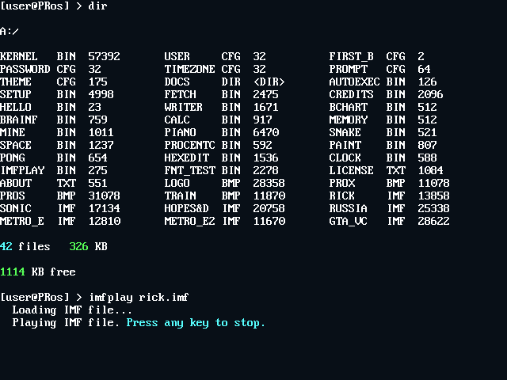<br>
    <b>IMFPLAY.BIN</b><br>
    IMF music player
  </td>
  <td width="33%" align="center">
    <br>
    <b>CLOCK.BIN</b><br>
    Clock application
  </td>
  <td width="33%" align="center">
    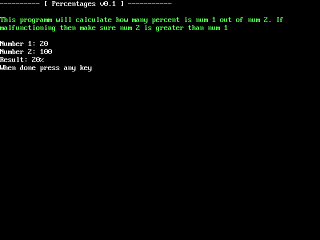<br>
    <b>PROCENTC.BIN</b><br>
    Percentages calculator
  </td>
</tr>
<tr>
  <td width="33%" align="center">
    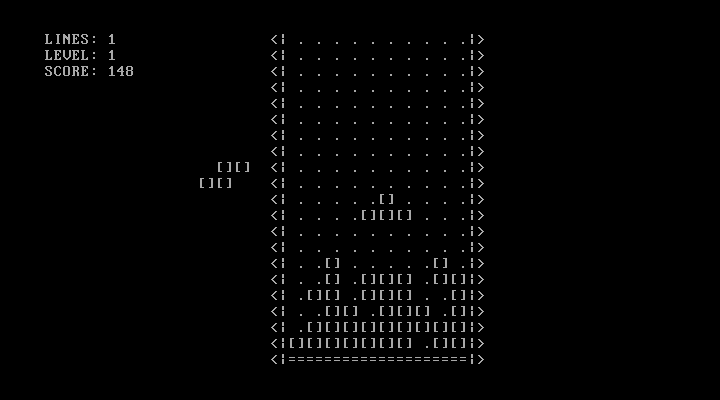<br>
    <b>TETRIS.BIN</b><br>
    Tetris game
  </td>
  <td width="33%" align="center">
    <br>
    <b>MANDEL.BIN</b><br>
    Mandelbrot-Menge
  </td>
    <td width="33%" align="center">
    <br>
    <b>BRAINF.BIN</b><br>
    Brainfuck interpreter
  </td>
</tr>
<tr>
  </td>
    <td width="33%" align="center">
    <br>
    <b>SETTINGS.BIN</b><br>
    x16-PRos system settings
  </td>
<td width="33%" align="center">
    <br>
    <b>And MUCH more...</b><br>
    SNAKE.BIN, CREDITS.BIN, AUTOEXEC.BIN, GREP.BIN, HEAD, TAIL, THEME.BIN, CHARS.BIN, WAVPLAY.BIN, FDISK.BIN, ED.BIN, HELLO.COM, FRACTAL.COM, CALENDAR.BIN
  </td>
</tr>
</table>

**Developing Your Own Programs**

You can create custom programs using NASM and the PRos API.

---


## 🛠️ Building and Running

### Dependencies

| Distro | Command |
|---|---|
| Debian / Ubuntu | `sudo apt install nasm mtools dosfstools qemu-system-x86` |
| Arch / Manjaro | `sudo pacman -Syu nasm mtools dosfstools qemu-system-x86` |
| Fedora / CentOS | `sudo dnf install nasm mtools dosfstools qemu-system-x86` |

Only NASM, mtools and dosfstools are needed to build the x16-PRos and QEMU for running.

### Building

1. **Clone the repository:**
```bash
git clone https://github.com/PRoX2011/x16-PRos.git
cd x16-PRos
```

2. **Make build script executable:**
```bash
chmod +x build-linux.sh
```

3. **Build the project:**
```bash
./build-linux.sh
```

The build writes `disk_img/x16pros.img` (bootable 1.44 MB image), `disk_img/HDD.img`
(5 MB hard disk image) and the separate binaries in `bin/`.

> [!NOTE]
> FOR ADVANSED USERS
> build-linux have special flags:
> ```
> -quiet            - disable all script messages, but not disable nasm's warnings and errors
> -no-music         - do not add music files in system build
> -no-txt           - do not add text files in system build
> -no-boot-recomp   - do not compiling bootloader, in system build using old compiled bootloader from bin/ directory
> -no-kernel-recomp - do not compiling kernel, in system build using old compiled kernel from bin/ directory
> -dtm              - disable setup on first boot. dev testing mode.
> ```

### Running

```bash
./run-linux.sh
```

The script starts QEMU with both floppies, the hard disk, PC speaker and AdLib sound.

#### OR 

By hand, with the floppy alone:

```bash
qemu-system-x86_64 -display gtk -fda disk_img/x16pros.img -machine pcspk-audiodev=snd0 -device adlib,audiodev=snd0 -audiodev pa,id=snd0
```

**On real hardware**: write the image to a USB stick (or floppy) and boot in BIOS mode. On a UEFI
machine turn on CSM or Legacy Boot first.

---

## Contributing

### How to Contribute

1. **Report Bugs**: Open an issue on [GitHub Issues](https://github.com/PRoX2011/x16-PRos/issues)
2. **Submit Code**: Fork, develop, and create pull requests
3. **Write Programs**: Develop applications using the [PRos API](docs/API.md)
4. **Improve Docs**: Email suggestions to prox.dev.code@gmail.com

**More about contributing:** [contributing guide](CONTRIBUTING.md)

---

<div align="center">

**Made with ❤️ by PRoX**

</div>
