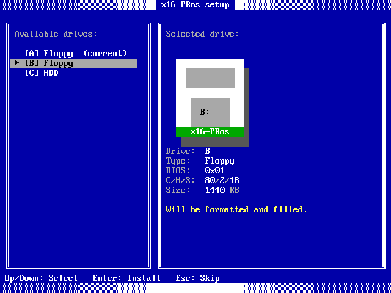
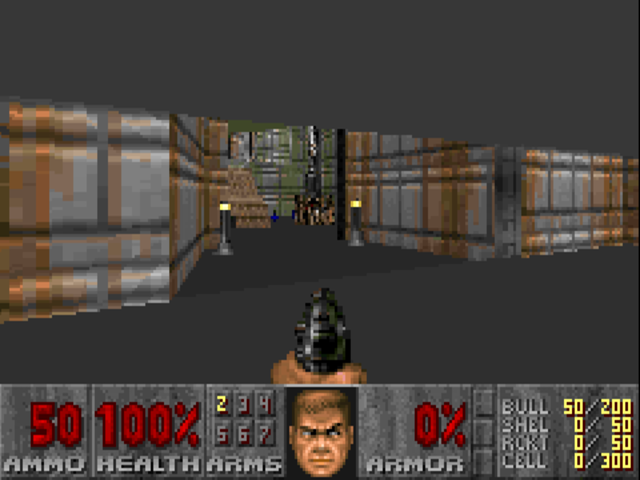

<div align="center">


<h1>x16-PRos Operating System</h1>

[](LICENSE.TXT)
[](docs/changes/v1.0.txt)

[](https://github.com/PRoX2011/x16-PRos/stargazers)
[](https://github.com/PRoX2011/x16-PRos/commits)
[](CONTRIBUTING.md)


**A minimalistic 16-bit operating system written in NASM for x86 architecture**

<div style="display: flex; flex-direction: row; gap: 20px">
  
  
</div>

---

</div>


## Overview

**x16-PRos** is a lightweight real-mode multitasking operating system designed for the x86 architecture and written entirely in NASM. It features CLI, TUI and GUI interfaces, supports the FAT12 file system, and includes a large standard software suite.

Also it`s a platform for low-level programming enthusiasts to explore development for x86 operating systems.

- **[API](docs/API.md)** - x16-PRos system calls
- **[Programs package](docs/PROGRAMS.md)** - every bundled program, with screenshots
- **[Configuration](docs/CONFIGURATION.md)** - config files and what each of them changes
- **[Contributing](CONTRIBUTING.md)** - coding standards, program templates and how to send changes

---

<div style="display: flex; flex-direction: row; gap: 20px">
  
  
</div>
<br>
<div style="display: flex; flex-direction: row; gap: 20px">
  
  
</div>

---

## Key Features

- **MS-DOS Compatibility**: Native support for running standard MS-DOS `.COM` and `.EXE` executables - Windows 1.01, DOOM and Turbo C 2.0 runs on x16-PRos
- **Multitasking**: Cooperative multitasking support for `.PLE` programs
- **GUI**: Customizable graphical user interface for windowed `.PLE` programs
- **Native assembler**: Intel syntax assembler with which you can create programs directly in the operating system  
- **User Authentication**: Login system with configurable user account using XOR-encrypted password
- **Customization**: 10+ color themes and fully customizable THEME.CFG, command prompt, username, timezone, and font settings
- **Over 40 bundled programs**: Games, file utilities, players, BMP viewer with upscale, paint program, and more
- **First-Boot Setup**: A setup wizard that installs the OS on your PC and helps you to customize everything for yourself 
- **Auto-Execution**: AUTOEXEC.BIN support
- **Mouse Driver**: Mouse support for `.BIN` and `.PLE` programs and MS-DOS compatibility layer
- **Multiple disk support**: Detect/list available drives, switch drives, install x16-PRos on any of theese
- **cp866 support**: Russian-language text documents reading in cp866 encoding
- **Sound**: PC speaker, Sound Blaster WAV playback and AdLib/OPL2 IMF music
- **AND MUCH MORE**

---

## Building and Running

### Dependencies

| Distro | Command |
|---|---|
| Debian / Ubuntu | `sudo apt install nasm mtools dosfstools qemu-system-x86` |
| Arch / Manjaro | `sudo pacman -Syu nasm mtools dosfstools qemu-system-x86` |
| Fedora / CentOS | `sudo dnf install nasm mtools dosfstools qemu-system-x86` |

Only NASM, mtools and dosfstools are needed to build the x16-PRos and QEMU for running.

### Building

1. **Clone the repository:**
```bash
git clone https://github.com/PRoX2011/x16-PRos.git
cd x16-PRos
```

2. **Make build script executable:**
```bash
chmod +x build-linux.sh
```

3. **Build the project:**
```bash
./build-linux.sh
```

The build writes `disk_img/x16pros.img` (bootable 1.44 MB image), `disk_img/HDD.img`
(5 MB hard disk image) and the separate binaries in `bin/`.

> [!NOTE]
> FOR ADVANSED USERS
> build-linux have special flags:
> ```
> -quiet            - disable all script messages, but not disable nasm's warnings and errors
> -no-music         - do not add music files in system build
> -no-txt           - do not add text files in system build
> -no-boot-recomp   - do not compiling bootloader, in system build using old compiled bootloader from bin/ directory
> -no-kernel-recomp - do not compiling kernel, in system build using old compiled kernel from bin/ directory
> -dtm              - disable setup on first boot. dev testing mode.
> ```

### Running

```bash
./run-linux.sh
```

The script starts QEMU with both floppies, the hard disk, PC speaker and AdLib sound.

#### OR 

By hand, with the floppy alone:

```bash
qemu-system-x86_64 -display gtk -fda disk_img/x16pros.img -machine pcspk-audiodev=snd0 -device adlib,audiodev=snd0 -audiodev pa,id=snd0
```

**On real hardware**: write the image to a USB stick (or floppy) and boot in BIOS mode. On a UEFI
machine turn on CSM or Legacy Boot first.

---

## Contributing

### How to Contribute

1. **Report Bugs**: Open an issue on [GitHub Issues](https://github.com/PRoX2011/x16-PRos/issues)
2. **Submit Code**: Fork, develop, and create pull requests
3. **Write Programs**: Develop applications using the [PRos API](docs/API.md)
4. **Improve Docs**: Email suggestions to prox.dev.code@gmail.com

**More about contributing:** [contributing guide](CONTRIBUTING.md)

---

<div align="center">

**Made with ❤️ by PRoX**

</div>
