# x16-PRos programs package

<table>
<tr>
  <td width="33%" align="center">
     
    <b>GUI.PLE</b> 
    Window manager: desktop with icons, draggable and resizable windows
  </td>
  <td width="33%" align="center">
    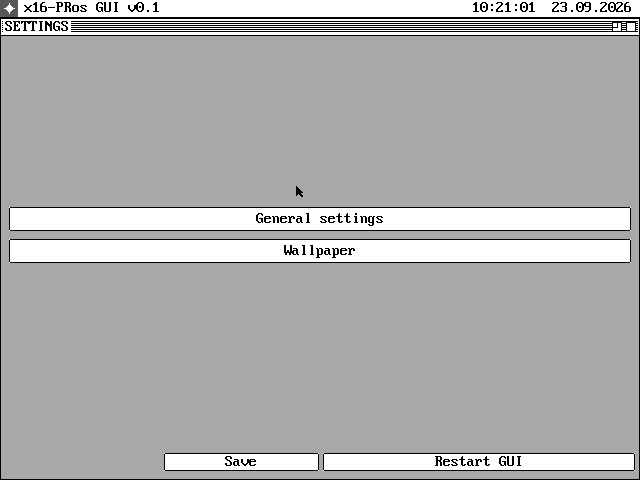 
    <b>SETTINGS.PLE</b> 
    GUI settings: icon corners, label gap and wallpaper
  </td>
  <td width="33%" align="center">
    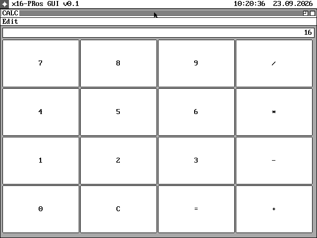 
    <b>CALC.PLE</b> 
    Calculator for simple math
  </td>
</tr>
<tr>
  <td width="33%" align="center">
    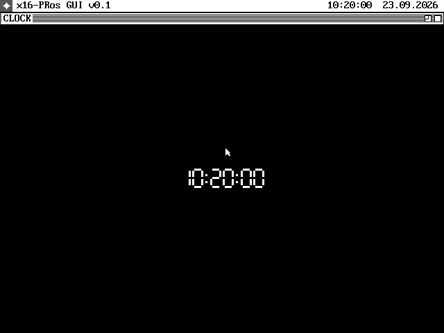 
    <b>CLOCK.PLE</b> 
    Digital clock
  </td>
  <td width="33%" align="center">
    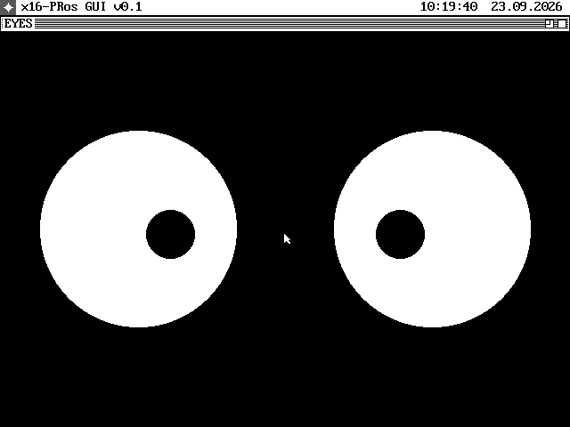 
    <b>EYES.PLE</b> 
    Googly eyes follow the cursor
  </td>
  <td width="33%" align="center">
    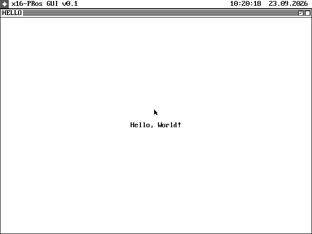 
    <b>HELLO.PLE</b> 
    Just another hello world :)
  </td>
</tr>
<tr>
  <td width="33%" align="center">
    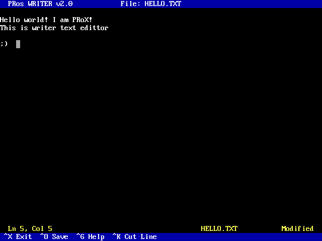 
    <b>WRITER.BIN</b> 
    Simple editor for text files
  </td>
  <td width="33%" align="center">
    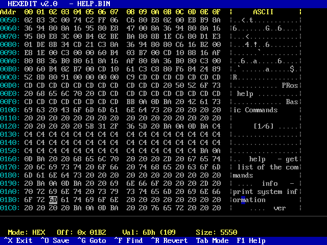 
    <b>HEXEDIT.BIN</b> 
    Hex editor
  </td>
  <td width="33%" align="center">
    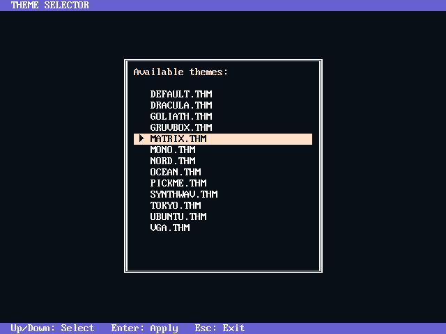 
    <b>THEME.BIN</b> 
    Theme selector, applies one of the bundled colour themes
  </td>
</tr>
<tr>
  <td width="33%" align="center">
    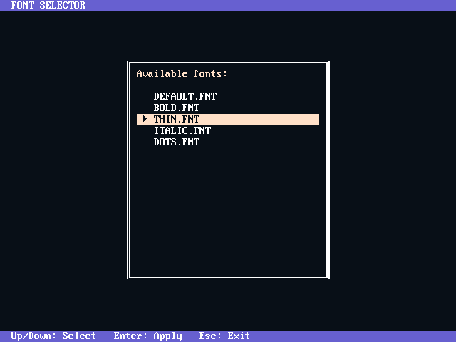 
    <b>FONT.BIN</b> 
    Font selector, lists .FNT files from FONTS.DIR and applies them
  </td>
  <td width="33%" align="center">
    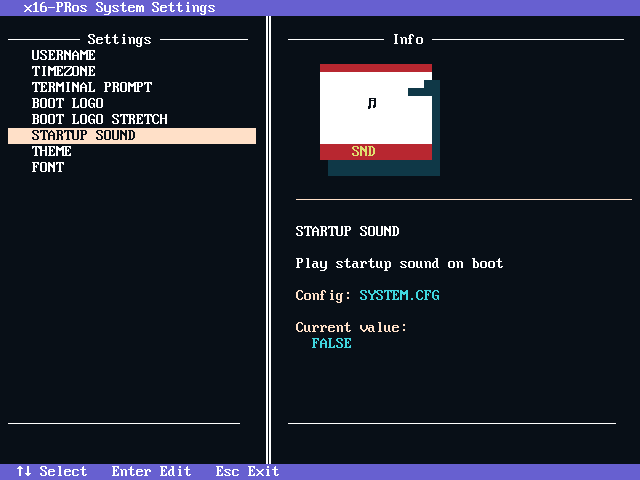 
    <b>SETTINGS.BIN</b> 
    x16-PRos system settings: username, timezone and more
  </td>
  <td width="33%" align="center">
    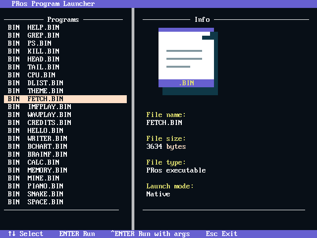 
    <b>LAUNCH.BIN</b> 
    TUI program launcher
  </td>
</tr>
<tr>
  <td width="33%" align="center">
    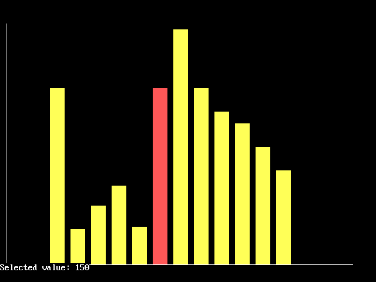 
    <b>BCHART.BIN</b> 
    Barchart software for creating simple diagrams
  </td>
  <td width="33%" align="center">
    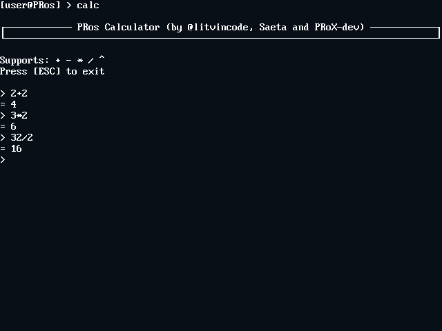 
    <b>CALC.BIN</b> 
    Simple calculator
  </td>
  <td width="33%" align="center">
    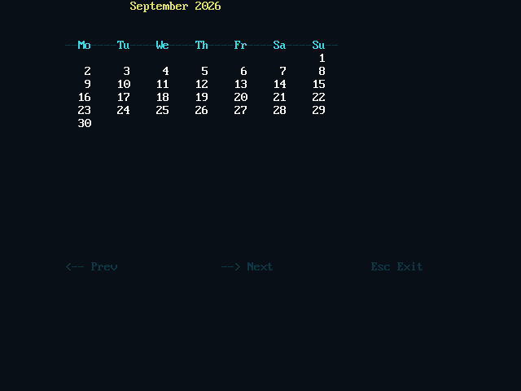 
    <b>CALENDAR.BIN</b> 
    Calendar viewer with month navigation
  </td>
</tr>
<tr>
  <td width="33%" align="center">
    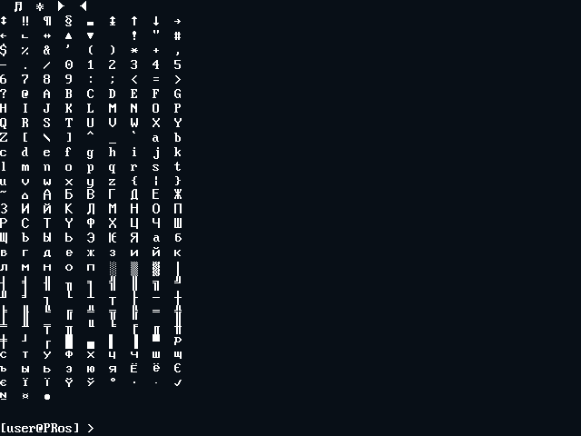 
    <b>CHARS.BIN</b> 
    Prints the whole cp866 character set
  </td>
  <td width="33%" align="center">
    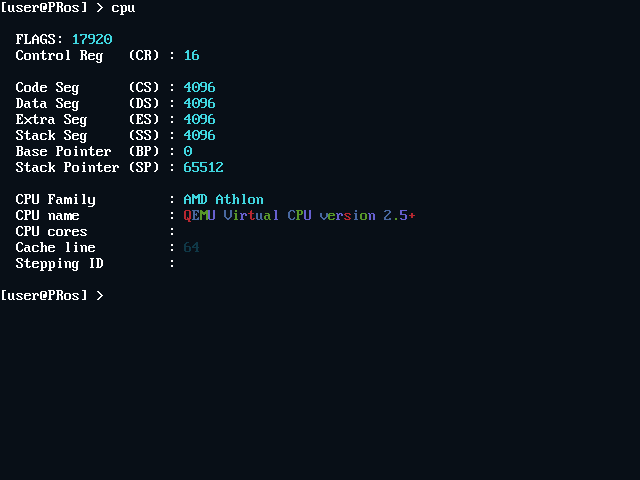 
    <b>CPU.BIN</b> 
    Shows CPU and register information
  </td>
  <td width="33%" align="center">
    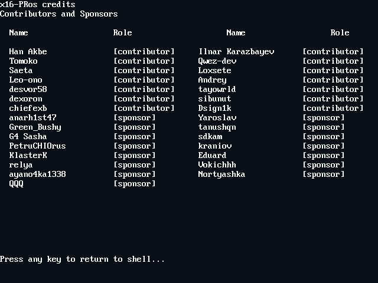 
    <b>CREDITS.BIN</b> 
    Contributors and sponsors list
  </td>
</tr>
<tr>
  <td width="33%" align="center">
    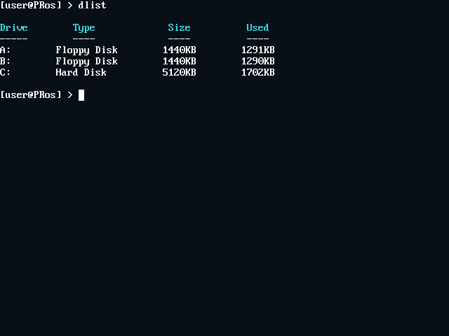 
    <b>DLIST.BIN</b> 
    Lists the available drives with size and usage
  </td>
  <td width="33%" align="center">
    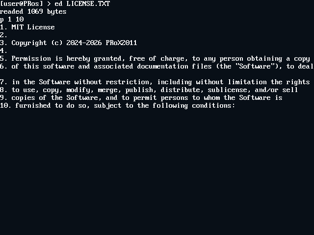 
    <b>ED.BIN</b> 
    Line editor for text files, see EDMAN.TXT
  </td>
  <td width="33%" align="center">
    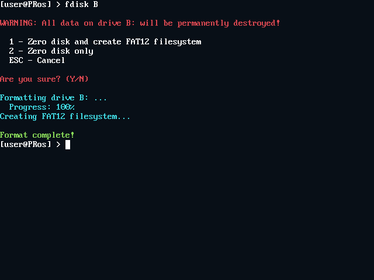 
    <b>FDISK.BIN</b> 
    Floppy disk format utility
  </td>
</tr>
<tr>
  <td width="33%" align="center">
    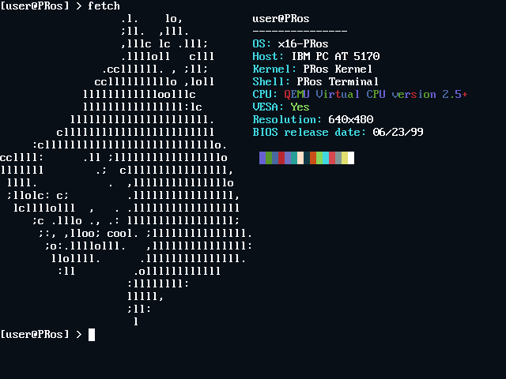 
    <b>FETCH.BIN</b> 
    Print system fetch (I use PRos btw)
  </td>
  <td width="33%" align="center">
    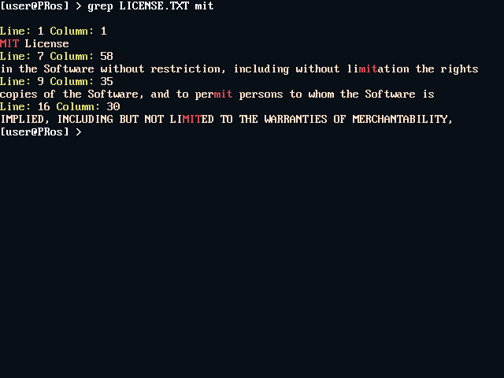 
    <b>GREP.BIN</b> 
    Searches a file for a string
  </td>
  <td width="33%" align="center">
    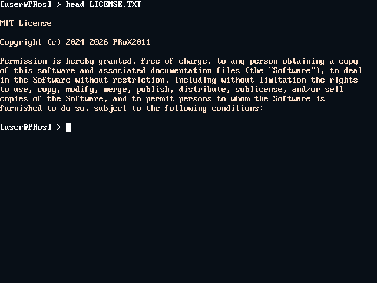 
    <b>HEAD.BIN</b> 
    Prints the first 10 lines of a file
  </td>
</tr>
<tr>
  <td width="33%" align="center">
    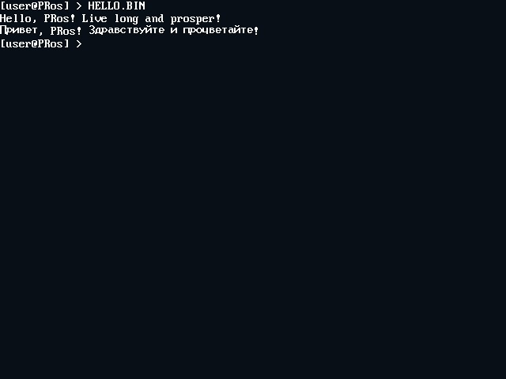 
    <b>HELLO.BIN</b> 
    Hello world, in English and in Russian
  </td>
  <td width="33%" align="center">
    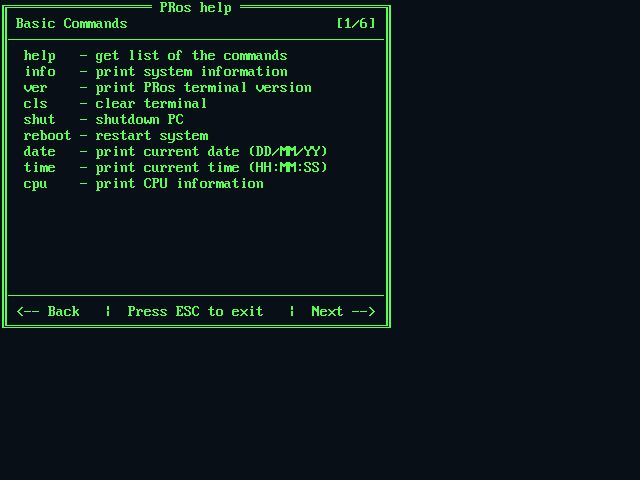 
    <b>HELP.BIN</b> 
    Shows all kshell commands
  </td>
  <td width="33%" align="center">
    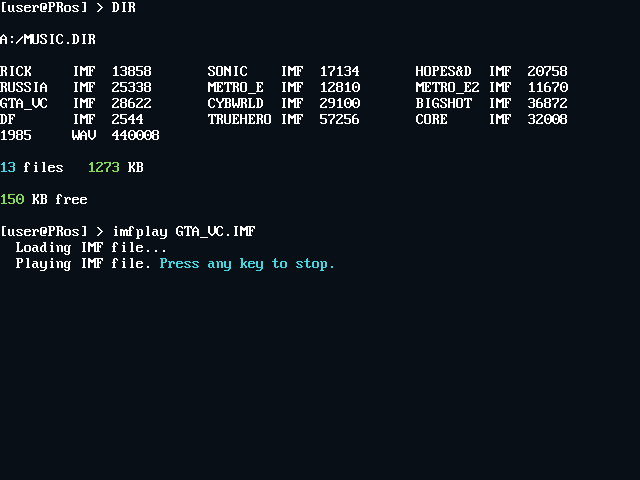 
    <b>IMFPLAY.BIN</b> 
    IMF music player
  </td>
</tr>
<tr>
  <td width="33%" align="center">
    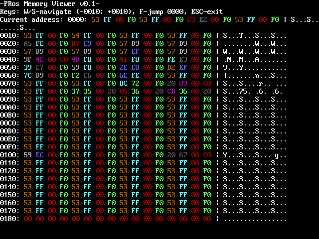 
    <b>MEMORY.BIN</b> 
    Memory viewer
  </td>
  <td width="33%" align="center">
    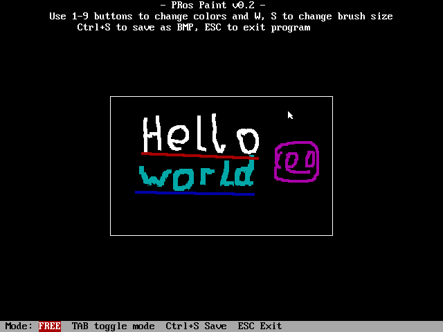 
    <b>PAINT.BIN</b> 
    Paint program
  </td>
  <td width="33%" align="center">
    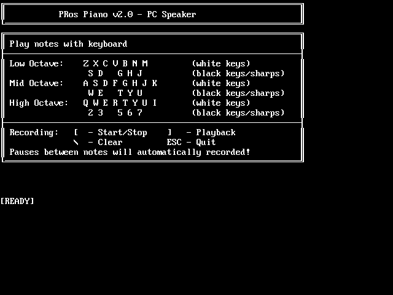 
    <b>PIANO.BIN</b> 
    Simple piano to play melodies using PC Speaker
  </td>
</tr>
<tr>
  <td width="33%" align="center">
    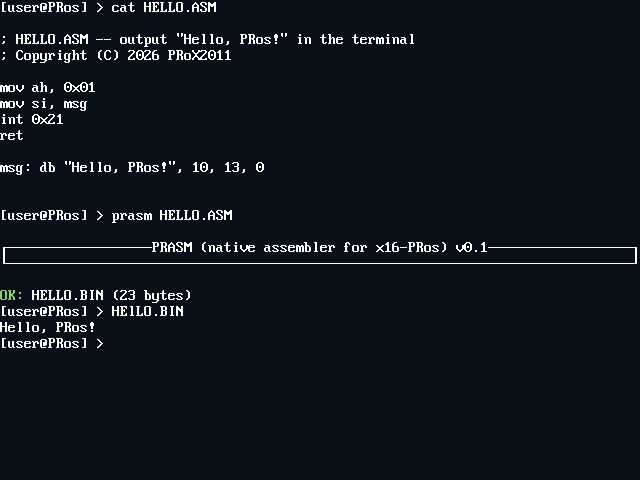 
    <b>PRASM.BIN</b> 
    Native two-pass assembler
  </td>
  <td width="33%" align="center">
    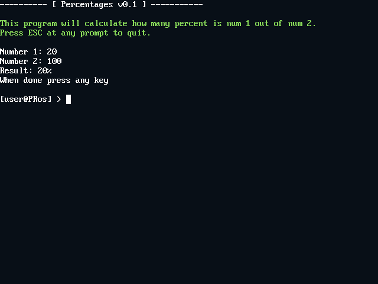 
    <b>PROCENTC.BIN</b> 
    Percentages calculator
  </td>
  <td width="33%" align="center">
     
    <b>SETUP.BIN</b> 
    First-boot wizard that installs the OS and sets it up
  </td>
</tr>
<tr>
  <td width="33%" align="center">
    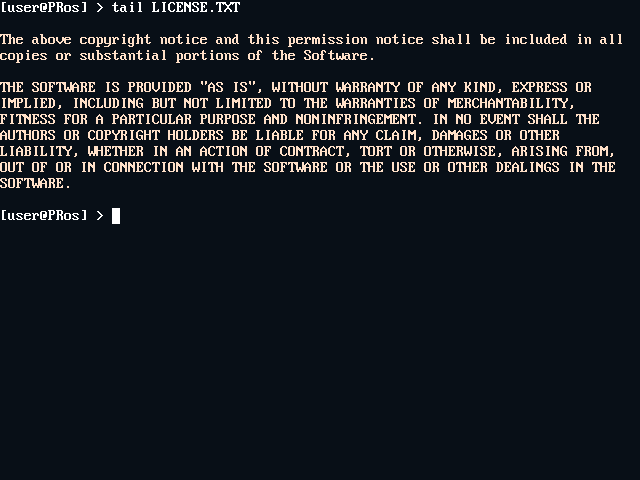 
    <b>TAIL.BIN</b> 
    Prints the last 10 lines of a file
  </td>
  <td width="33%" align="center">
    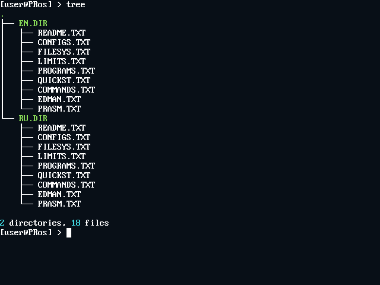 
    <b>TREE.BIN</b> 
    Directory tree viewer
  </td>
  <td width="33%" align="center">
    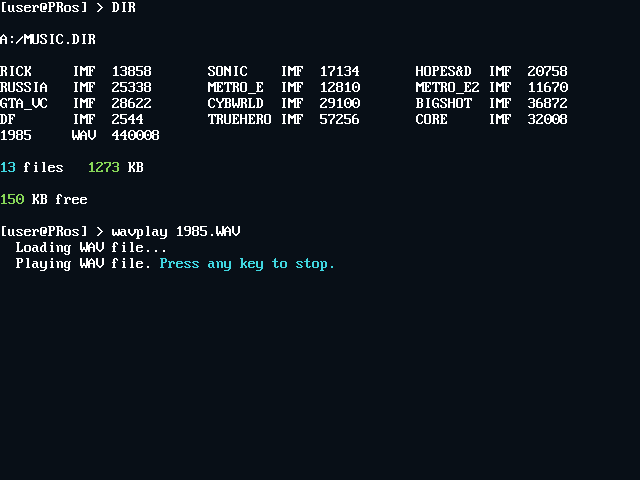 
    <b>WAVPLAY.BIN</b> 
    WAV player through Sound Blaster
  </td>
</tr>
<tr>
  <td width="33%" align="center">
    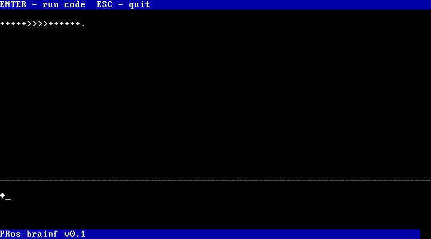 
    <b>BRAINF.BIN</b> 
    Brainfuck interpreter
  </td>
  <td width="33%" align="center">
    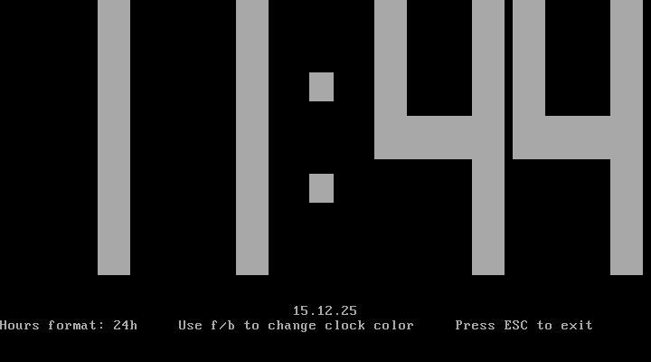 
    <b>CLOCK.BIN</b> 
    Clock application
  </td>
  <td width="33%" align="center">
    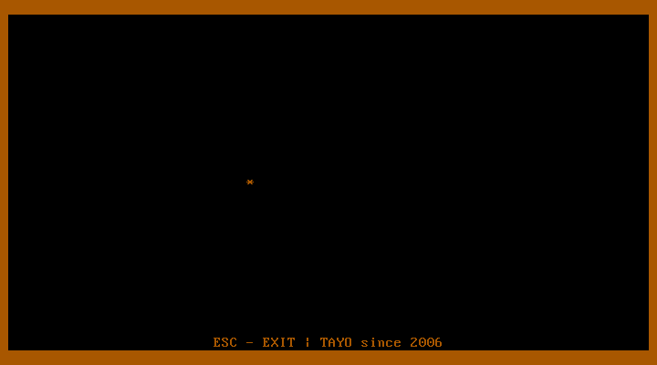 
    <b>EYE.BIN</b> 
    Eye exercise, follow the dot around the screen
  </td>
</tr>
<tr>
  <td width="33%" align="center">
    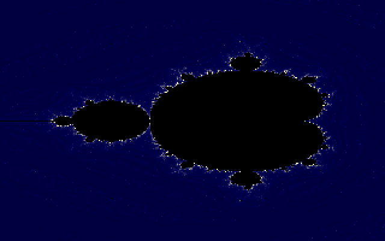 
    <b>MANDEL.BIN</b> 
    Mandelbrot set renderer
  </td>
  <td width="33%" align="center">
    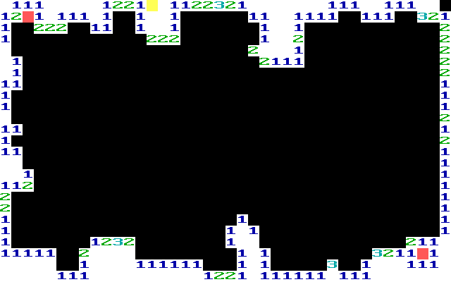 
    <b>MINE.BIN</b> 
    Minesweeper game
  </td>
  <td width="33%" align="center">
     
    <b>PONG.BIN</b> 
    Pong game
  </td>
</tr>
<tr>
  <td width="33%" align="center">
    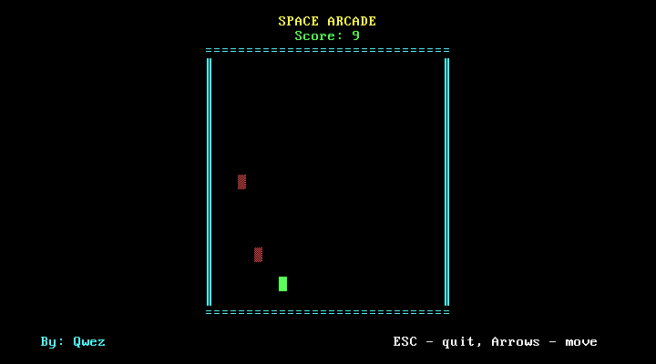 
    <b>SPACE.BIN</b> 
    Space arcade game
  </td>
  <td width="33%" align="center">
     
    <b>TETRIS.BIN</b> 
    Tetris game
  </td>
  <td width="33%" align="center">
    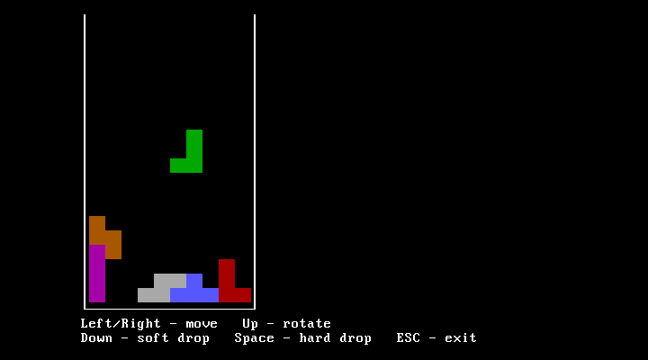 
    <b>TETRIS2.BIN</b> 
    Tetris, but 2
  </td>
</tr>
</table>
